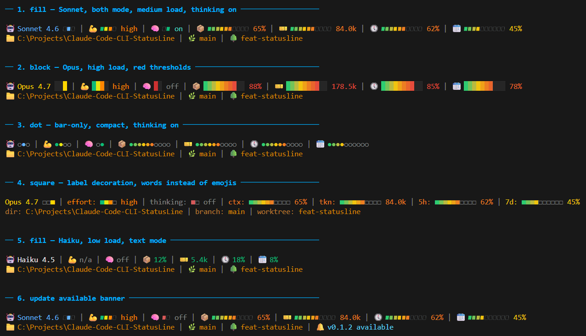

# Claude Code CLI Status Line

> ⚠️ **Beta**  
  This project is currently in beta. There is **no guarantee** that the scripts work correctly on every system or configuration.  
  *Use at your own risk and feel free to report issues!*

## What is it?

A two-line, colored status line for the **[Claude Code CLI](https://claude.ai/code)** that shows all relevant session data at a glance:
- the current model (color-coded by type)
- the effort level
- thinking mode status
- context usage and token count
- rate limits for both the 5-hour and 7-day windows
- the working directory
- the active git branch
- the active worktree (if applicable)

Each metric can be shown as text, a coloured bar, both, or hidden. Colors automatically shift from green → yellow → red as configured thresholds are crossed, making critical states immediately visible without interrupting Claude's output.

Every segment can be prefixed with either a compact emoji (🤖 💪 🧠 📦 🎫 🕔 📆 / 📁 🌿 🌳) or a word label, and bar glyphs are switchable between four styles — all configurable via an interactive TUI.

A built-in update checker also pings GitHub on a configurable interval (off / daily / weekly / monthly) and shows a small 🔔 hint in the status line when a new release is available.

## How it Works

Claude Code passes a JSON object to the status line via stdin. The script reads it, determines the git branch via `git branch --show-current` in the current working directory, and returns the formatted, colored output — implemented in Python 3 (standard library only) and works on Linux, macOS, and Windows.


## Examples



> *Example values for illustrating the color stages.*

**Line 1** — Model (colored by type), effort, thinking status, context usage (`ctx`), token count (`tkn`), rate limits (5h / 7d)<br>
**Line 2** — Working directory, git branch, active worktree (in bronze tones, truncated to fit terminal width with dynamic, shared-space allocation — short segments release unused characters to long ones)

Colors automatically shift green → yellow → red depending on usage. The label next to a bar uses the colour of the bar's most recent segment, so the active threshold stays visible at a glance.


## Color Scheme

| Element | Color |
|---------|-------|
| Opus | 🟡 Gold |
| Sonnet | 🔵 Light blue |
| Haiku | ⚪ White |
| thinking:on | 🟢 Teal |
| thinking:off | ⚫ Dimmed gray |
| effort / ctx / tkn / 5h / 7d (low) | 🟢 Green |
| effort / ctx / tkn / 5h / 7d (medium) | 🟡 Yellow |
| effort / ctx / tkn / 5h / 7d (high) | 🔴 Red |
| dir / branch / worktree labels | 🟤 Rust brown |
| dir / branch / worktree values | 🟠 Warm bronze |


## Display modes

Each line 1 metric can be rendered in one of four modes (`text` / `bar` / `both` / `off`):

| Mode | Example (ctx at 42%) |
|------|----------------------|
| `text` | `ctx: 42%` |
| `bar` | `ctx ▰▰▰▰▱▱▱▱▱▱` |
| `both` | `ctx ▰▰▰▰▱▱▱▱▱▱ 42%` |
| `off` | *(hidden)* |

Defaults: `effort`, `ctx`, `5h`, `7d` use `bar`; `model`, `thinking`, `tkn` use `text`.


## Decoration: emoji or label

A single global switch controls whether every segment (on both lines) is prefixed with an **emoji** or a **word label**:

| Segment | Emoji | Label |
|---------|-------|-------|
| model | 🤖 | `model` |
| effort | 💪 | `effort` |
| thinking | 🧠 | `thinking` |
| ctx | 📦 | `ctx` |
| tkn | 🎫 | `tkn` |
| 5h | 🕔 | `5h` |
| 7d | 📆 | `7d` |
| dir | 📁 | `dir` |
| branch | 🌿 | `branch` |
| worktree | 🌳 | `worktree` |

Default: `emoji`.


## Bar style

When a metric is shown as a bar (`bar` or `both` mode), the glyphs are configurable:

| Style | Filled | Empty | Look |
|-------|--------|-------|------|
| `fill` | ▰ | ▱ | Subtle, slightly rounded |
| `block` | █ | ░ | Strong contrast, classic |
| `dot` *(default)* | ● | ○ | Battery-indicator style |
| `square` | ■ | □ | Clean, geometric |


## Thresholds

Default thresholds (configurable in the TUI):

| Metric | Yellow at | Red at |
|--------|-----------|--------|
| ctx | 60% | 80% |
| tkn | 60% | 80% |
| 5h rate limit | 60% | 80% |
| 7d rate limit | 60% | 80% |


# Installation

Everything — install, configure, uninstall — runs through a single interactive TUI. There is no separate install script: the TUI's main menu has a toggle entry that becomes **Install** when the status line is not registered in `~/.claude/settings.json` and **Uninstall** when it is. Selecting it copies (or removes) `statusline.py` in `~/.claude/` and updates `settings.json` accordingly. Existing files are backed up as `.bak.<timestamp>`.

There are two ways to launch the TUI:

## Option A — clone the repo *(recommended)*

```bash
git clone https://github.com/luport-dev/Claude-Code-CLI-StatusLine.git
cd Claude-Code-CLI-StatusLine
```

Then run the platform-specific launcher:

```bash
./setup/linux/setup.sh    # Linux
./setup/mac/setup.sh      # macOS
setup\win\setup.cmd       # Windows (CMD)
```

All three are thin wrappers that just call `python3 setup/settings.py` (or `python` on Windows).

## Option B — via npx *(not published yet)*

> ⚠️ **Not yet available on the npm registry.** The npm wrapper exists in this repo (`npm/`) but `claude-code-statusline` has not been published yet. Until the first npm release this command will fail — use **Option A** instead.

```bash
npx -y claude-code-statusline
```

Once published, this will fetch the npm wrapper, locate `python3` (or `python` / `py` on Windows), and start the TUI. From there pick **Install** from the main menu, configure as desired, then **q** to save and quit. Restart Claude Code afterwards.

> Requires Node.js (any version ≥ 14) and Python 3. The `-y` flag auto-confirms npx's download prompt so the call never blocks.

## Manual installation

If you'd rather skip the TUI entirely, copy [`scripts/statusline.py`](scripts/statusline.py) to `~/.claude/statusline.py` and add the following to `~/.claude/settings.json`:

```json
{
  "statusLine": {
    "type": "command",
    "command": "python3 /home/YOUR_USERNAME/.claude/statusline.py"
  }
}
```

On Windows use forward slashes and `python` instead of `python3`:

```json
{
  "statusLine": {
    "type": "command",
    "command": "python C:/Users/YOUR_USERNAME/.claude/statusline.py"
  }
}
```

> **Windows path note**: Claude Code routes status line commands through Git Bash when available, and backslashes get eaten as escape characters. See the [official docs](https://code.claude.com/docs/en/statusline#windows-configuration).

> *Restart Claude Code — the status line is loaded on **next startup**.*


# Requirements

| Platform | Requirements |
|----------|--------------|
| Linux | `git`, Python 3.8+ |
| macOS | `git`, Python 3.8+ |
| Windows | `git`, Python 3.8+, plus `windows-curses` for the TUI |

None of the scripts install Python automatically — if it's missing they print a warning with a hint. Install Python yourself:

<details>
<summary><strong>Linux</strong></summary>

```bash
sudo apt install git python3        # Debian / Ubuntu / Mint
sudo dnf install git python3        # Fedora / RHEL / CentOS
sudo pacman -S git python            # Arch / Manjaro
sudo zypper install git python3     # openSUSE
```

</details>

<details>
<summary><strong>macOS</strong></summary>

Via [Homebrew](https://brew.sh):

```bash
brew install git python
```

Alternatively, running `git --version` will prompt to install Git via the Xcode Command Line Tools. Python can also be installed from [python.org](https://www.python.org/downloads/mac-osx/).

</details>

<details>
<summary><strong>Windows</strong></summary>

Install Git from [git-scm.com](https://git-scm.com/download/win) and Python from [python.org](https://www.python.org/) (or via winget):

```powershell
winget install --id Git.Git -e
winget install --id Python.Python.3.12 -e
pip install windows-curses
```

> When installing Python, make sure **"Add python.exe to PATH"** is checked.

</details>


# Configuration TUI

The same TUI handles install/uninstall and all configuration. Settings are saved to `~/.claude/statusline_config.json`.

**Main menu**
```
╭───────────────── Claude Code Status Line — Settings ────────────────────────╮
│                                                                             │
│  > [%] Metrics visibility                                                   │
│    [!] Metrics thresholds                                                   │
│    [/] Git visibility                                                       │
│    [#] Decoration (emoji/label)                                             │
│    [=] Bar style                                                            │
│    [~] Update checks                                                        │
│    [ ] Install      ← toggles to "[x] Uninstall" once registered            │
│                                                                             │
│             config: ~/.claude/statusline_config.json                        │
│                                                                             │
│  ↑↓ navigate  Ent open  q save & quit  esc quit                             │
╰─────────────────────────────────────────────────────────────────────────────╯
```

Pressing **Esc** with unsaved changes opens a confirmation dialog listing every modified value (e.g. `~ thresholds.ctx.warn: 60 -> 55`, `~ bar_style: 'fill' -> 'dot'`). Choose **Save changes** or **Discard changes** — shortcuts `s` / `d` work too.

**Metrics visibility** — per-metric display mode
```
╭───────────────────────── Metrics visibility ───────────────────────╮
│                                                                    │
│   selected model: Sonnet 4.6                                       │
│                                                                    │
│   metric    bar       text      both      off                      │
│                                                                    │
│   model     ( )       (*)       ( )       ( )                      │
│   effort    ( )       (*)       ( )       ( )                      │
│   thinking  ( )       (*)       ( )       ( )                      │
│   context   ( )       ( )       (*)       ( )                      │
│   tokens    ( )       (*)       ( )       ( )                      │
│   5h        ( )       ( )       (*)       ( )                      │
│   7d        ( )       ( )       (*)       ( )                      │
│                                                                    │
│   ↑↓ metric  ←→ mode  b/t/h/o set  esc back                        │
╰────────────────────────────────────────────────────────────────────╯
```

**Thresholds**
```
╭───────────────────── Metrics thresholds ────────────────────────────╮
│                                                                     │
│  context warn: [ 60]%          crit: [ 80]%                         │
│  tokens  warn: [ 60]%          crit: [ 80]%                         │
│  5h      warn: [ 60]%          crit: [ 80]%                         │
│  7d      warn: [ 60]%          crit: [ 80]%                         │
│                                                                     │
│  ↑↓ row  ←→ field  +/- ±1  PgUp/Dn ±5  0-9 type  esc back           │
╰─────────────────────────────────────────────────────────────────────╯
```

**Git visibility** (line 2)
```
╭──────────────── Git visibility ────────────────╮
│                                                │
│  [x] dir                                       │
│  [x] branch                                    │
│  [x] worktree                                  │
│                                                │
│  ↑↓ navigate  Spc/Ent toggle  esc back         │
╰────────────────────────────────────────────────╯
```

**Decoration**
```
╭──────────────────────── Decoration ─────────────────────────╮
│                                                             │
│   Prefix shown in front of each segment (all display modes):│
│                                                             │
│     (*) emoji   (🤖 💪 🧠 📦 🪙 🕔 📅)                       │
│     ( ) label   (model effort thinking ctx tkn 5h 7d)       │
│                                                             │
│   ↑↓ choose  Ent/Spc select  esc back                       │
╰─────────────────────────────────────────────────────────────╯
```

**Bar style**
```
╭──────────────────────── Bar style ──────────────────────────╮
│                                                             │
│   Glyphs used for filled / empty bar segments:              │
│                                                             │
│     (*) fill     ▰▰▰▰▰▱▱▱▱▱   (default)                     │
│     ( ) block    █████░░░░░                                 │
│     ( ) dot      ●●●●●○○○○○                                 │
│     ( ) square   ■■■■■□□□□□                                 │
│                                                             │
│   ↑↓ choose  Ent/Spc select  esc back                       │
╰─────────────────────────────────────────────────────────────╯
```


**Update checks**
```
╭──────────────────────── Update checks ──────────────────────╮
│                                                             │
│   How often to check GitHub for a new release               │
│   installed: 0.1.0    latest: 0.1.0                         │
│                                                             │
│     ( ) never     no update checks                          │
│     ( ) daily     check once per day                        │
│     (*) weekly    check once per week                       │
│     ( ) monthly   check once per month                      │
│                                                             │
│   ↑↓ choose  Ent/Spc select  esc back                       │
╰─────────────────────────────────────────────────────────────╯
```

When a newer release is available on GitHub, a small **🔔 v0.1.1 available** segment is appended to line 2 and a banner appears in the TUI's main menu. The check runs in a background thread (3 s timeout) so the status line never blocks. Result is cached in `~/.claude/statusline_update.json`. Default interval: `weekly`.


## Files

| File | Description |
|------|-------------|
| [`scripts/statusline.py`](scripts/statusline.py) | Status line script (all platforms) |
| [`setup/settings.py`](setup/settings.py) | Interactive TUI — handles install, configure, and uninstall |
| [`setup/default_config.json`](setup/default_config.json) | Default configuration (copied on first install) |
| [`setup/linux/setup.sh`](setup/linux/setup.sh) | Linux launcher |
| [`setup/mac/setup.sh`](setup/mac/setup.sh) | macOS launcher |
| [`setup/win/setup.cmd`](setup/win/setup.cmd) | Windows launcher |
| [`npm/`](npm/) | npm wrapper that enables `npx -y claude-code-statusline` |


# License

This project is licensed under the MIT License. See [LICENSE](LICENSE) for details.
