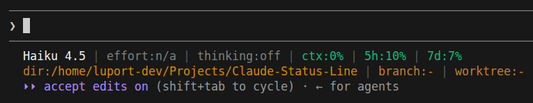
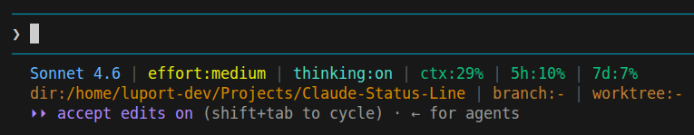
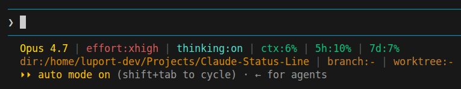

# Claude Code CLI Status Line

> ⚠️ **Beta**  
  This project is currently in beta. There is **no guarantee** that the scripts work correctly on every system or configuration.  
  *Use at your own risk and feel free to report issues!*

## What is it?

A two-line, colored status line for the **[Claude Code CLI](https://claude.ai/code)** that shows all relevant session data at a glance: 
- the current model (color-coded by type)
- the effort level
- thinking mode status
- context usage and token count
- rate limits for both the 5-hour and 7-day windows
- the working directory
- the active git branch
- the active worktree (if applicable)

Colors automatically shift from green to yellow to red as defined thresholds are crossed, making critical states immediately visible without interrupting Claude's output.

## How it Works

Claude Code passes a JSON object to the status line via stdin. The script reads it, determines the git branch via `git branch --show-current` in the current working directory, and returns the formatted, colored output — implemented in Python 3 (standard library only) and works on Linux, macOS, and Windows.


## Examples







> *Example values for illustrating the color stages.*

**Line 1** — Model (colored by type), effort, thinking status, context usage (`ctx`), token count (`tkn`), rate limits (5h / 7d)<br>
**Line 2** — Working directory, git branch, active worktree (in bronze tones, truncated to fit terminal width)

Colors automatically shift green → yellow → red depending on usage.


## Color Scheme

| Element | Color |
|---------|-------|
| Opus | 🟡 Gold |
| Sonnet | 🔵 Light blue |
| Haiku | ⚪ White |
| thinking:on | 🟢 Teal |
| thinking:off | ⚫ Dimmed gray |
| effort / ctx / tkn / 5h / 7d (low) | 🟢 Green |
| effort / ctx / tkn / 5h / 7d (medium) | 🟡 Yellow |
| effort / ctx / tkn / 5h / 7d (high) | 🔴 Red |
| dir / branch / worktree labels | 🟤 Rust brown |
| dir / branch / worktree values | 🟠 Warm bronze |


## Thresholds

Default thresholds (configurable via `configure`):

| Metric | Yellow at | Red at |
|--------|-----------|--------|
| ctx | 70% | 90% |
| tkn | 70% | 90% |
| 5h rate limit | 70% | 90% |
| 7d rate limit | 50% | 80% |


## Configuration

Run the interactive configuration tool to customize thresholds and line 2 visibility:

```bash
# Linux
./setup/linux/configure.sh

# macOS
./setup/macos/configure.sh
```

```cmd
# Windows (CMD)
setup\win\configure.cmd
```

The TUI lets you adjust warning/critical thresholds for each metric and toggle which fields appear on line 2 (dir, branch, worktree). Settings are saved to `~/.claude/statusline_config.json`.

> On Windows, `windows-curses` is installed automatically by `install.cmd`.


## Files

| File | Description |
|------|-------------|
| [`scripts/statusline.py`](scripts/statusline.py) | Status line script (all platforms) |
| [`setup/_settings.py`](setup/_settings.py) | Shared settings helper |
| [`setup/configure.py`](setup/configure.py) | Interactive configuration TUI |
| [`setup/linux/install.sh`](setup/linux/install.sh) | Linux install |
| [`setup/linux/configure.sh`](setup/linux/configure.sh) | Linux configure |
| [`setup/macos/install.sh`](setup/macos/install.sh) | macOS install |
| [`setup/macos/configure.sh`](setup/macos/configure.sh) | macOS configure |
| [`setup/win/install.cmd`](setup/win/install.cmd) | Windows install |
| [`setup/win/configure.cmd`](setup/win/configure.cmd) | Windows configure |


# Requirements

| Platform | Requirements |
|----------|--------------|
| Linux | `git`, Python 3.8+ |
| macOS | `git`, Python 3.8+ |
| Windows | `git`, Python 3.8+ (installed automatically by `install.cmd` if missing) |

<details>
<summary><strong>Linux</strong> — Installing Git and Python</summary>

Depending on the distribution:

```bash
sudo apt install git python3        # Debian / Ubuntu / Mint
sudo dnf install git python3        # Fedora / RHEL / CentOS
sudo pacman -S git python            # Arch / Manjaro
sudo zypper install git python3     # openSUSE
```

Verify: `git --version` and `python3 --version` should both output a version number.

</details>

<details>
<summary><strong>macOS</strong> — Installing Git and Python</summary>

Via [Homebrew](https://brew.sh):

```bash
brew install git python
```

Alternatively, running `git --version` will prompt to install Git via the Xcode Command Line Tools. Python can also be installed from [python.org](https://www.python.org/downloads/mac-osx/).

Verify: `git --version` and `python3 --version` should both output a version number.

</details>

<details>
<summary><strong>Windows</strong> — Installing Git and Python</summary>

Install Git from [git-scm.com](https://git-scm.com/download/win). Python 3 is installed automatically by `install.cmd` via winget if not already present. Alternatively, install manually:

```powershell
winget install --id Git.Git -e
winget install --id Python.Python.3.12 -e
```

> When installing Python, make sure **"Add python.exe to PATH"** is checked.

Verify: `git --version` and `python --version` (or `py --version`) should both output a version number.

</details>
<br>


# Installing the Status Line

The fastest way: **clone the repo** and **run the setup script** for your platform.  
It copies the right files to `~/.claude/` and merges the `statusLine` entry into `settings.json` (existing files are backed up as `.bak.<timestamp>`).

```bash
git clone https://github.com/luport-dev/Claude-Code-CLI-StatusLine.git
cd Claude-Code-CLI-StatusLine
```

<details>
<summary><strong>Linux</strong></summary>

Requires `git` and Python 3.

**Setup scripts:**

```bash
./setup/linux/install.sh      # install
./setup/linux/uninstall.sh    # uninstall
./setup/linux/configure.sh    # configure thresholds & visibility
```

**Manual installation:**

Copy [`scripts/statusline.py`](scripts/statusline.py) to `~/.claude/statusline.py`. Then reference it in `~/.claude/settings.json` under `statusLine`:

```json
{
  "statusLine": {
    "type": "command",
    "command": "python3 /home/YOUR_USERNAME/.claude/statusline.py"
  }
}
```

</details>

<details>
<summary><strong>macOS</strong></summary>

Requires `git` and Python 3.

**Setup scripts:**

```bash
./setup/macos/install.sh      # install
./setup/macos/uninstall.sh    # uninstall
./setup/macos/configure.sh    # configure thresholds & visibility
```

**Manual installation:**

Copy [`scripts/statusline.py`](scripts/statusline.py) to `~/.claude/statusline.py`. Reference it in `~/.claude/settings.json` under `statusLine`:

```json
{
  "statusLine": {
    "type": "command",
    "command": "python3 /Users/YOUR_USERNAME/.claude/statusline.py"
  }
}
```

</details>

<details>
<summary><strong>Windows</strong></summary>

Requires `git`. Python 3 is installed automatically if missing.

**Setup scripts** — in a regular terminal (CMD):

```cmd
setup\win\install.cmd      rem install
setup\win\uninstall.cmd    rem uninstall
setup\win\configure.cmd    rem configure thresholds & visibility
```

The install script copies `statusline.py` to `%USERPROFILE%\.claude\statusline.py` and merges the `statusLine` entry into `settings.json` (existing files are backed up as `.bak.<timestamp>`). It also installs `windows-curses` so the configuration TUI works.

**Manual installation:**

Copy [`scripts/statusline.py`](scripts/statusline.py) to `%USERPROFILE%\.claude\statusline.py`. In `~/.claude/settings.json`, reference it under `statusLine`:

```json
{
  "statusLine": {
    "type": "command",
    "command": "python C:/Users/YOUR_USERNAME/.claude/statusline.py"
  }
}
```

> Replace `YOUR_USERNAME` with your Windows username. **Use forward slashes** in the path — Claude Code routes status line commands through Git Bash on Windows when present, and backslashes get eaten as escape characters. See the [official docs](https://code.claude.com/docs/en/statusline#windows-configuration).

</details>
</br>


> *Restart Claude Code — the status line will be loaded on **next startup**.*


# License

This project is licensed under the MIT License. See [LICENSE](LICENSE) for details.
